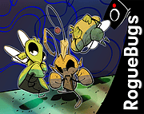

# Hi! I'm Piotrek!
## 🛠️ Techstack
<code></code>
<code></code>
<code></code>
<code></code>
<code></code> 

## 🎮 Games I've worked on!

<table>
  <tr>
    <td width="150">
      
    </td>
    <td>
      
<b><a href="https://forklovee.itch.io/roguebug">Rogue Bugs (2025)</a></b>

      
<strong>Role:</strong> Programmer, Game Designer

      
<em>A 3D beat 'em up platformer about rebellious insects.</em>

    </td>
  </tr>

  <tr>
    <td width="150">
      
    </td>
    <td>
      
<b><a href="https://forklovee.itch.io/robo-and-blob-of-void">Robo and the Unknowable Blob of Void (2025)</a></b>

      
<strong>Role:</strong> Programmer, Game Designer, 2D/3D Artist

      
<em>A short 3D puzzle/strategy game made in Godot 4 about a robot facing cosmic horror.</em>

    </td>
  </tr>

  <tr>
    <td width="150">
      
    </td>
    <td>
      
<b><a href="https://forklovee.itch.io/a-world-apart-from-man-jam">A WORLD A/PART: FROM MAN (2024)</a></b>

      
<strong>Role:</strong> Programmer, 3D Artist, Writer

      
<em>3D metroidvania made in Unreal Engine 5 where a forgotten machine unravels the secrets of humanity’s ruins. </em>

    </td>
  </tr>
</table>
